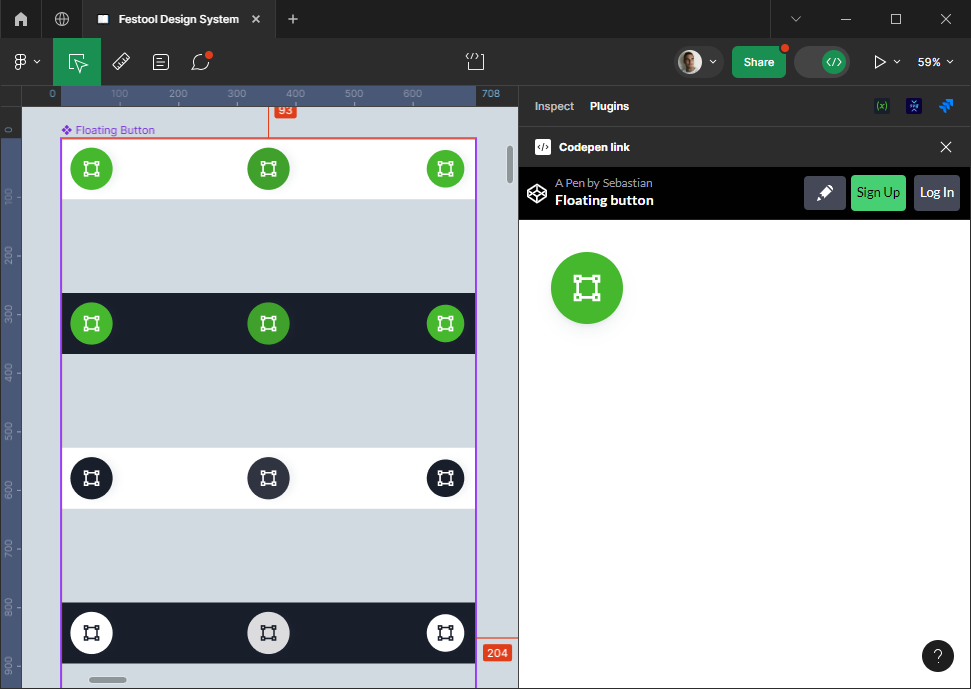

# Figma Plugin: Codepen (for Dev Mode)

## Getting startet

After `git clone`, don't forget to install npm dependencies:

```bash
npm install
```

## Run

```bash
npm run build
```

```bash
npm run watch
```


```bash
npm run lint
```

```bash
npm run lint:fix
```

## Preview

